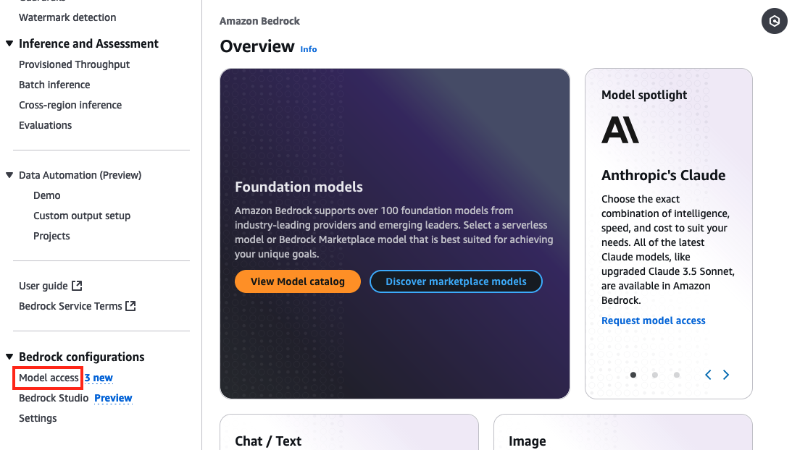
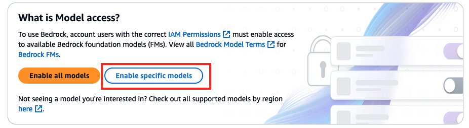
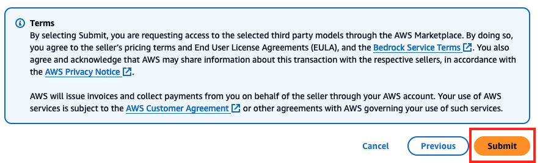

# 🐉 Chapter 0: An Unexpected Adventure

If you are running this workshop in an AWS event, an AWS account will be provisioned for you.

To get started, go to AWS Console. Go to Amazon Bedrock console and on left menu, click on **Model access**:

On the Model access screen, on top right, click on the button **"Enable specific models"**:

On model access screen, select **only** the following models and click on **"Next"** button:

**Anthropic**
* Claude 3.5 Haiku
* Claude 3.5 Sonnet
* Claude 3.7 Sonnet

A "Review and submit" screen will appear, review selected models, review Terms, and click on Submit:

