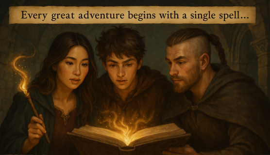

# 🧙‍♂️ Chapter 1: The Art of Agent Summoning




Welcome to your first lesson in the mystical arts of Strands! In this foundational chapter, you'll learn to conjure your very first AI agent companion - a digital familiar that will serve as your guide through the realms of code.

## 🎯 Quest Objective

Master the fundamental ritual of agent creation by completing the `simple_agent.py` file. You'll transform empty TODO comments into a living, breathing AI companion ready for adventure!

## 📜 The Sacred Steps

Your quest involves four essential incantations:

### Step 1: Enable the Sight Beyond Sight 👁️
**TODO**: Add debug logging to see what your agent is thinking

Before summoning your agent, it's wise to enable the mystical sight that lets you peer into your agent's mind. [Debug logging](https://strandsagents.com/latest/documentation/docs/user-guide/observability-evaluation/logs/) reveals the hidden workings of your digital companion.

### Step 2: Forge Your Digital Companion 🤖
**TODO**: Create an Agent with the following [system prompt](https://strandsagents.com/latest/documentation/docs/user-guide/concepts/agents/prompts/): "You are a game master for a Dungeon & Dragon game"

The system prompt is your agent's character sheet - it defines their personality, knowledge, and behavior. Think of it as writing the backstory for your digital familiar.

Note that by default, Strands will call Claude 3.7 on Amazon Bedrock.

### Step 3: Awaken Your Creation 🌟
**TODO**: Summon your agent with a basic incantation such as: "Hi, I am an adventurer ready for adventure!"

Time to breathe life into your creation! This first interaction will test if your summoning ritual was successful.


## 🎲 Testing Your Creation

Once you've completed all TODOs, run your script:

```bash
python simple_agent.py
```

If successful, your newly summoned Game Master should respond with enthusiasm, perhaps setting the scene for an epic D&D adventure!

## 🎉 Quest Complete!

Congratulations! You've successfully summoned your first AI agent. Your digital Game Master is now ready to guide players through epic adventures.

**What you've learned:**
- ✅ How to enable debug logging to see your agent's internal workings
- ✅ How to create your first AI agent using Strands
- ✅ The importance of system prompts in shaping agent behavior  
- ✅ Basic agent interaction and testing patterns

**Next Adventure**: Head to Chapter 2 to learn about equipping your agent with magical tools and abilities!

---

_"A wizard is never late, nor is he early. He arrives precisely when he means to... just like a well-configured agent!"_ 🧙‍♂️✨