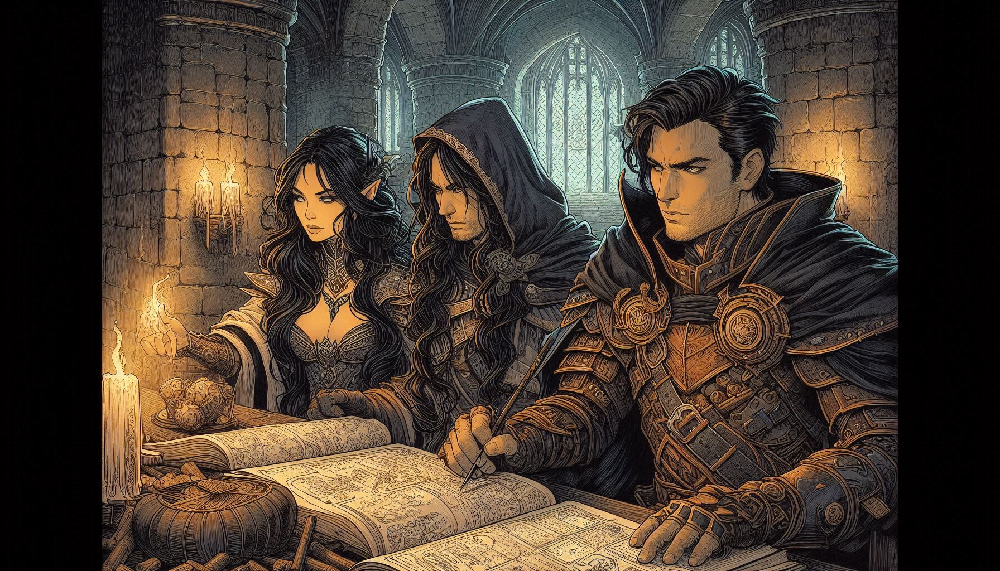

# 🌐 Chapter 4: Planar Portals - MCP Integration (Model Context Protocol)



_"Opening portals to distant realms..."_

Welcome to the arcane arts of planar connections, brave traveler! In this chapter, you'll learn the mystical art of the [Model Context Protocol (MCP)](https://strandsagents.com/latest/documentation/docs/user-guide/concepts/tools/mcp-tools/) - the magic that allows your agents to connect to external services and invoke powers from distant realms.

## 🎯 Quest Objective

Master the art of MCP portals by creating a two-component system:
1. **An MCP Server** (`dice_roll_mcp_server.py`) - That exposes the dice rolling service
2. **An MCP Client** (`gamemaster_mcp_client.py`) - That connects to the server and uses its tools

## 🔮 The MCP Philosophy

The Model Context Protocol allows separation of tools from agents:
- **🏰 MCP Servers**: Expose specialized tools via a standardized protocol
- **🧙‍♂️ MCP Clients**: Connect to servers to use their tools
- **🌉 Benefits**: Reusability, scalability, separation of concerns

## 📜 Part 1: Forging the MCP Server (`dice_roll_mcp_server.py`)

### Step 1: Import FastMCP 📚
**TODO**: Import FastMCP from mcp.server

You need to import the FastMCP class to create your MCP server. The `random` and `logging` modules are already imported for you.

**Why this import?**
- `FastMCP`: The MCP server that exposes your tools to other applications

### Step 2: Create the MCP Server 🏰
**TODO**: Create an MCP server with name "D&D Dice Roll Service" on port 8080

Create a FastMCP instance with the specified name, host "0.0.0.0", and port 8080.

### Step 3: Run the MCP Server 🚀
**TODO**: run the MCP server

Add the line to start the MCP server using the appropriate transport method.

The `@mcp.tool()` decorator is already implemented for you!

## 📜 Part 2: Create the MCP Client (`gamemaster_mcp_client.py`)

### Step 1: Import Connection Tools 🔗
**TODO**: Import Agent, MCPClient and streamablehttp_client from the strands library

You need to import three components:
- `Agent` from strands
- `MCPClient` from strands.tools.mcp  
- `streamablehttp_client` from mcp.client.streamable_http

### Step 2: Create MCPClient Connection 🌉
**TODO**: Create MCPClient connecting to "http://localhost:8080/mcp"

Create an MCPClient instance that connects to the dice server. Use a lambda function that returns `streamablehttp_client("http://localhost:8080/mcp")`.

### Step 3: Use the Context Manager 🔒
**TODO**: Use the MCP client in a context manager (with statement)

Wrap your agent code in a `with` statement using the MCP client to ensure proper connection management.

### Step 4: Get Available Tools �️
**TODO**: Get available tools from MCP server using list_tools_sync()

Call the `list_tools_sync()` method on your MCP client to retrieve available tools from the server.

### Step 5: Add Tools to Agent 🤖
**TODO**: Add MCP tools to the gamemaster agent using tool_registry.process_tools()

Use the agent's `tool_registry.process_tools()` method to add the MCP tools to your gamemaster agent.

## 🎲 Testing Your MCP System

### Step 1: Launch the Server
```bash
python dice_roll_mcp_server.py
```
You should see: "Starting D&D Dice Roll MCP Server on port 8080..."

### Step 2: Launch the Client (in another terminal)
```bash
python gamemaster_mcp_client.py
```

### Step 3: Test Dice Rolling
Try these commands:
- "Roll a d20"
- "Roll a d6" 
- "Roll a d100"
- "Roll 4d6 for ability scores"

## 🌟 Benefits of MCP Architecture

**🔄 Reusability**: The dice server can be used by multiple clients
**📈 Scalability**: Easy to add new tools to the server
**🛡️ Isolation**: Services are separated and independent
**🔧 Maintenance**: Update one service without affecting others

## 🎉 Quest Complete!

Congratulations, Portal Master! You've mastered the mystical art of the Model Context Protocol. Your system can now:

**What you've mastered:**
- ✅ Creating MCP servers that expose tools
- ✅ Connecting MCP clients to remote services
- ✅ Integrating MCP tools into Strands agents
- ✅ Distributed architecture for agent systems

**Loot Acquired:**
- 🌐 MCP dice rolling server
- 🧙‍♂️ MCP client with Lady Luck
- 🔗 Distributed architecture skills
- 🎲 Centralized and reusable dice system

**Next Adventure**: Head to Chapter 5 where you'll discover Agent-to-Agent (A2A) communication and learn to orchestrate teams of specialized agents!

---

_"A well-opened portal is worth a thousand local tools!"_ 🌐✨