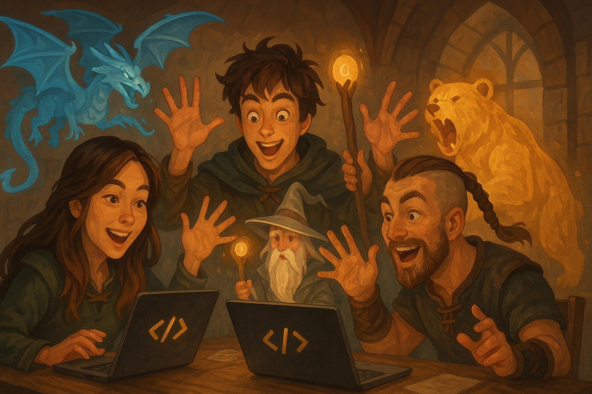

# 🏰 Chapter 5: The Grand Alliance - Agent-to-Agent Mastery



_"No great quest is accomplished alone. Even the mightiest heroes need allies..."_

Welcome to the most epic chapter of your journey, Master Architect! Here you'll learn the ancient art of **Agent Orchestration** with [Agent2Agent (A2A)](https://strandsagents.com/latest/documentation/docs/user-guide/concepts/multi-agent/agent-to-agent/) - commanding multiple specialized AI companions to work in perfect harmony. You'll forge a legendary D&D Game Master system where each agent brings unique expertise to create truly immersive adventures.

## 🎯 Quest Objective

Construct the **Grand Alliance** - a fellowship of three specialized agents working together to run the ultimate D&D experience:

- **🧙‍♂️ The Sage of Rules**: A wise keeper of D&D lore and mechanics
- **⚔️ The Character Chronicler**: A master of heroes, stats, and legendary tales  
- **👑 The Grand Orchestrator**: The supreme Game Master who coordinates all adventures

## 🏰 The Architecture of Legends

```
        🧙‍♂️ The Sage of Rules    ⚔️ Character Chronicler    🎲 Dice Oracle
           (Port 8000)              (Port 8001)            (Port 8080)
                │                        │                      │
                └────────────────────────┼──────────────────────┘
                                         │
                              👑 The Grand Orchestrator
                                   (Port 8009)
                                 [The Master's Throne]
```

## 🗡️ The Fellowship's Powers

Your **Grand Alliance** will possess legendary abilities:
- **📚 Ancient Wisdom**: Instant access to all D&D rules and mechanics
- **👥 Hero Forging**: Create and manage legendary character sheets
- **🎲 Fate Weaving**: Roll dice and determine destinies
- **🎭 Epic Storytelling**: Orchestrate multi-layered adventures with perfect coordination

## 📚 Prerequisites

Make sure you have completed the previous chapters and understand:
- Basic Strands agents
- Tool creation with `@tool` decorator
- MCP integration


## 🧙‍♂️ Part 1: Awakening the Sage of Rules

Before the Sage can awaken, you must first forge the legendary **Knowledge Vault**! The ancient D&D Basic Rules must be transformed into magical text fragments and stored within the sacred `utils/dnd_knowledge_base/` ChromaDB. This enchanted repository will contain all the wisdom needed to answer any rules question that adventurers might pose.

### 🏛️ The Sacred Ritual of Knowledge Vault Creation

**⚠️ CRITICAL QUEST**: You must complete this ritual before proceeding, or the Sage will remain powerless!

#### 🔍 Step 1: Seek the Ancient Tome
Quest for the **D&D Basic Rules 2018 PDF** from the official Wizards of the Coast archives:
- Visit the official D&D website or search for "D&D Basic Rules 2018 PDF"
- Download the sacred tome (it's freely available)
- **Important**: The file must be named exactly `DnD_BasicRules_2018.pdf`

#### 📚 Step 2: Place the Tome in the Sacred Chamber
Move the PDF to its destined location:
- Place `DnD_BasicRules_2018.pdf` in the `5_a2a_integration/utils/` folder
- The tome must rest alongside the `create_knowledge_base.py` script

#### 🔮 Step 3: Perform the Transformation Ritual
Cast the ancient spell to transform the PDF into searchable knowledge:
```bash
cd 5_a2a_integration/utils
python create_knowledge_base.py
```
**⚠️ CRITICAL**: You must cast this spell from within the `utils` chamber, or the ritual will fail!

#### ✅ Step 4: Verify the Vault's Creation
Confirm that the Knowledge Vault has been successfully forged:
- Check that `5_a2a_integration/utils/dnd_knowledge_base/` folder exists
- Look for `chroma.sqlite3` and other mystical files within
- The console should show: "Knowledge base creation complete!"

### Your Ritual Tasks:

#### 🧙‍♂️ TODO 1: Summon the Sage of Rules
Complete the mystical binding ritual:

```python
agent = Agent(
    # TODO: Configure the agent with:
    # - model: Optional
    # - tools: List containing the query_dnd_rules tool
    # - name: "Rules Agent"
    # - description: "Fast D&D rules lookup"
    # - system_prompt: Instructions for the agent to use the tool once and answer immediately
)
```

#### 🏰 TODO 2: Establish the Sage's Tower
Construct the mystical communication spire:

```python
# TODO: Create an A2AServer instance with:
# - agent: The agent instance created above
# - port: 8000 (Rules Agent port)
a2a_server = None
```

#### 🌟 TODO 3: Open the Tower Gates
Complete the awakening ceremony:

```python
if __name__ == "__main__":
    # TODO: Start the A2A server
    pass
```

If successful, your Sage will stand ready in their tower, ancient knowledge at their fingertips!

## ⚔️ Part 2: Awakening the Character Chronicler

Behold the **Character Chronicler** - master of heroic tales and legendary statistics! This agent wields three powerful artifacts (already forged for your study):

- **🏗️ `create_character`**: Births new heroes with full backstories and abilities
- **🔍 `find_character_by_name`**: Locates heroes across the realm by name
- **📜 `list_all_characters`**: Reveals all heroes in the chronicles

**Study these legendary tools** to understand advanced patterns with dataclasses, databases, and complex character management!

### Your Ritual Tasks:

#### ⚔️ TODO 1: Summon the Character Chronicler
In `agents/character_agent/character_agent.py`, bind the Chronicler to their destiny:

```python
agent = Agent(
    # TODO: Configure the Character Agent with:
    # - model: optional
    # - tools: List of the tools
    # - name: "Character Creator Agent"
    # - description: Describe the agent's role in creating and managing D&D characters
)
```

#### 🏰 TODO 2: Establish the Hall of Heroes
```python
# TODO: Create an A2AServer instance with:
# - agent: The agent instance created above
# - port: 8001 (Character Agent port)
a2a_server = None
```

#### 🌟 TODO 3: Open the Hall's Doors
```python
if __name__ == "__main__":
    # TODO: Start the A2A server
    pass
```

Watch as the Hall of Heroes opens, ready to forge new legends!

## 👑 Part 3: Crowning the Grand Orchestrator

Behold the **Grand Orchestrator** - the supreme Game Master who commands the entire fellowship! This legendary being coordinates all agents, weaves epic narratives, and provides the mystical API gateway that adventurers use to enter your realm.

**The Orchestrator's Divine Powers:**
- **🌐 Agent Communication**: Commands the fellowship through A2A magic
- **🎲 Fate Integration**: Channels the MCP Dice Oracle for destiny rolls
- **🎭 Epic Storytelling**: Weaves responses from multiple agents into grand narratives
- **⚡ Lightning Responses**: Provides instant access through the sacred FastAPI portal

### Your Supreme Ritual Tasks:

#### 🎲 TODO 1: Channel the Dice Oracle
```python
# TODO: Create MCP Client for dice rolling service
# Initialize MCPClient with a lambda that returns streamablehttp_client("http://localhost:8080/mcp")
mcp_dice_client = None
```
Hint: Look back in Chapter 4 😉

#### 🤖 TODO 2: Create the A2A Client
In the `ask_agent` function:
```python
# TODO: Create the A2A client with the A2AClientToolProvider and pass the list of the known agent urls
```

#### 🛠️ TODO 3: Get MCP Tools
```python
# TODO: Get MCP tools
```

#### �`‍♂️ TODO 4: Create the Gamemaster Agent
```python
# TODO: Create the gamemaster agent with both A2A and MCP tools
agent = Agent(
    # model=optional,
    # tools= List of the A2A and MCP tools,
    # system_prompt=SYSTEM_PROMPT
)
```

The Grand Orchestrator will take their throne automatically when you run the script - no additional TODO needed for the uvicorn.run() call!

The Grand Orchestrator will take their throne, ready to command epic adventures!

## ⚔️ Part 4: The Grand Alliance Awakening Ceremony

### 🏰 Summon the Complete Fellowship:

Open 4 different termninals and run the following commands

**🎲 Awaken the Dice Oracle** (Sacred Terminal 0):
```bash
cd 4_mcp_integration
python dice_roll_mcp_server.py
```
*The Grand Orchestrator requires the mystical dice powers from Chapter 4!*

**🧙‍♂️ Awaken the Sage of Rules** (Sacred Terminal 1):
```bash
cd 5_a2a_integration/agents/rules_agent
python rules_agent.py
```

**⚔️ Open the Hall of Heroes** (Sacred Terminal 2):
```bash
cd 5_a2a_integration/agents/character_agent
python character_agent.py
```

**👑 Ascend the Master's Throne** (Sacred Terminal 3):
```bash
cd 5_a2a_integration/agents/gamemaster_orchestrator
python gamemaster_orchestrator.py
```

### 🎭 Epic Adventure Testing:

Channel your requests through the mystical `test/test.http` scroll or use these incantations:

```bash
# 📚 Consult the Ancient Wisdom
curl -X POST http://0.0.0.0:8009/inquire \
  -H "Content-Type: application/json" \
  -d '{"question": "What are the rules for dexterity checks?"}'

# ⚔️ Forge a New Hero
curl -X POST http://0.0.0.0:8009/inquire \
  -H "Content-Type: application/json" \
  -d '{"question": "Create a character named Thorin, a Dwarf Fighter with strength 16, dexterity 12, constitution 15"}'

# 🔍 Seek Hero Knowledge
curl -X POST http://0.0.0.0:8009/inquire \
  -H "Content-Type: application/json" \
  -d '{"question": "What is Thorin'\''s constitution?"}'

# 🎲 Call Upon the Dice Oracle
curl -X POST http://0.0.0.0:8009/inquire \
  -H "Content-Type: application/json" \
  -d '{"question": "Roll a d20 for initiative!"}'
```

**🎲 Watch the Magic Unfold:**
1. The Grand Orchestrator receives your quest
2. Automatically discovers and consults the appropriate fellowship members
3. The Sage provides ancient rule wisdom
4. The Chronicler manages heroic destinies
5. All responses are woven into epic narratives!

## 🎯 Learning Objectives

By completing this chapter, you'll understand:

- **Multi-Agent Architecture**: How to design systems with specialized agents
- **A2A Communication**: Agent-to-agent messaging and discovery
- **Service Orchestration**: Coordinating multiple services
- **Knowledge Base Integration**: Using vector databases for information retrieval
- **MCP Protocol**: Integrating external tools and services
- **Distributed Systems**: Building resilient, scalable agent networks

## 🏆 Bonus Challenges

1. **Add New Agents**: Create a Combat Agent for battle mechanics
2. **Enhance Discovery**: Implement dynamic agent discovery
3. **Add Persistence**: Store game sessions and character progression
4. **Create Adventures**: Build multi-step quest workflows
5. **Add Authentication**: Secure your API endpoints

## 🎉 Congratulations!

You've built a complete multi-agent D&D system! This architecture pattern can be applied to many domains where you need specialized agents working together to solve complex problems.

Your system demonstrates key concepts in distributed AI systems, microservices architecture, and agent orchestration that are essential for building production-scale AI applications.

Ready for your next adventure? Check out the advanced patterns in the solutions folder! 🚀