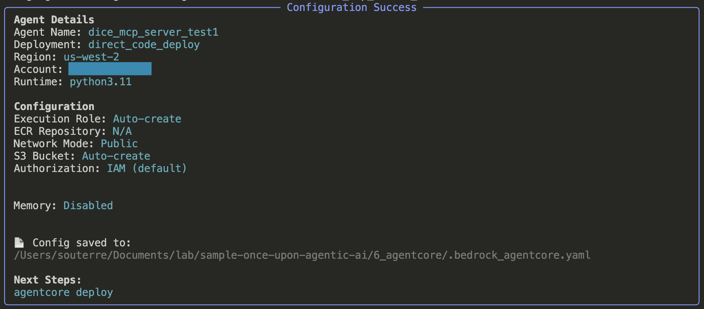
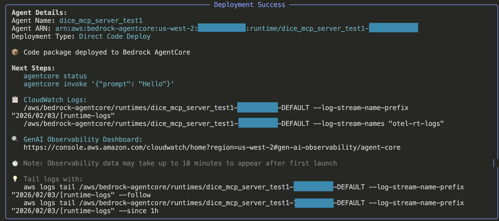
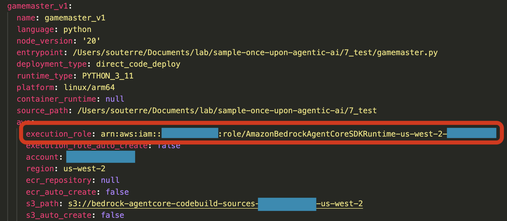
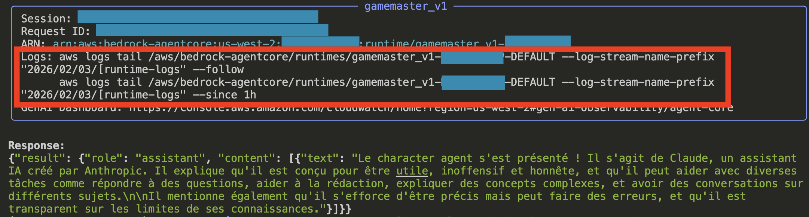

# AgentCore Workshop - MCP & A2A en Production

Ce workshop montre comment déployer des agents sur Amazon Bedrock AgentCore Runtime avec:
- **Serveur MCP** pour exposer des outils (dice roll)
- **Communication A2A** entre agents
- **Authentification AWS IAM** pour sécuriser les communications

## Architecture

```
┌─────────────────┐
│   Gamemaster    │ (Agent HTTP)
│   Agent         │
└────────┬────────┘
         │
         ├──MCP──→ ┌─────────────────┐
         │         │  Dice MCP       │ (Serveur MCP)
         │         │  Server         │
         │         └─────────────────┘
         │
         └──A2A──→ ┌─────────────────┐
                   │  Character      │ (Agent A2A)
                   │  Agent          │
                   └─────────────────┘
```

## Étape 1: Déployer le Serveur MCP

Le serveur MCP expose un outil `roll_dice` pour lancer des dés.

### 1.1 Configurer le serveur MCP
Allez à la racine du dossier 6_agentcore et lancer la commande:

```bash
agentcore configure \
  --entrypoint dice_mcp_server.py \
  --name my_mcp_server_name \
  --protocol MCP \
  --requirements-file mcp_requirements.txt \
  --disable-memory \
  --non-interactive
```

Voici ce que vous devriez voir dans votre terminal:




**Que se passe-t-il?**

Cette commande crée deux éléments:

1. **`.bedrock_agentcore.yaml`** - Fichier de configuration qui stocke:
   - Les paramètres de déploiement (nom, région, type de runtime)
   - Les configurations de tous vos agents
   - Les ARNs des ressources AWS créées
   - Les paramètres de mémoire, réseau, observabilité

2. **`.bedrock_agentcore/`** - Dossier qui contient:
   - Les packages de déploiement (code + dépendances)
   - Les caches de build pour accélérer les déploiements suivants

### 1.2 Déployer le serveur MCP

```bash
agentcore deploy --agent my_mcp_server_name
```
Voici ce que vous devriez voir dans votre terminal:



**Que se passe-t-il?**

Le CLI AgentCore orchestre automatiquement:

1. **Création des ressources AWS**:
   - Rôle IAM d'exécution (si nécessaire)
   - Bucket S3 pour le code source
   
2. **Build du package de déploiement**:
   - Installation des dépendances Python pour ARM64 (architecture AgentCore)
   - Packaging du code source
   - Upload vers S3

3. **Déploiement sur AgentCore Runtime**:
   - Création du runtime avec protocole MCP
   - Configuration de l'observabilité (CloudWatch Logs, X-Ray)
   - Attente que l'endpoint soit prêt

Le déploiement prend environ **2-3 minutes** la première fois (build des dépendances).

## Étape 2: Déployer le Character Agent (A2A)

Le character agent est un agent simple qui communique via le protocole A2A.

### 2.1 Configurer le character agent

```bash
agentcore configure \
  --entrypoint character_agent.py \
  --name my_character_agent_name \
  --protocol A2A \
  --requirements-file a2a_requirements.txt \
  --disable-memory \
  --non-interactive
```

### 2.2 Déployer le character agent

```bash
agentcore launch --agent my_character_agent_name
```

## Étape 3: Configurer les Variables d'Environnement

### 3.1 Comprendre le fichier .env.example

Le fichier `.env.example` est un **template** qui montre quelles variables d'environnement sont nécessaires. Il contient des valeurs placeholder que vous devez remplacer par vos propres valeurs.

**Important**: 
- `.env.example` est commité dans Git (pour documentation)
- `.env` est dans le `.gitignore` (contient vos vraies valeurs)

### 3.2 Créer votre fichier .env

Copiez le template et renommez le .env:

```bash
cp .env.example .env
```

### 3.3 Trouver les valeurs à remplir

#### MCP_SERVER_RUNTIME_ID

Pour récupérer le Runtime ID du serveur MCP, lancez cette commande:

```bash
agentcore status --agent my_mcp_server_name
```
Le runtime ID se retrouve à la fin de l'Agent ARN: `arn:aws:bedrock-agentcore:us-west-2:ACCOUNT_ID:runtime/my_mcp_server_name-XXXXXXXXXX`

Notez le Runtime ID dans votre fichier .env `MCP_SERVER_RUNTIME_ID=my_mcp_server_name-XXXXXXXXXX`

#### AWS_ACCOUNT_ID

Récupérez votre Account ID AWS:

```bash
aws sts get-caller-identity --query Account --output text
```
Notez le account id dans votre .env:
`AWS_ACCOUNT_ID=your-aws-account-id`

#### AWS_REGION

La région où vous déployez (par défaut: `AWS_REGION=us-west-2`)

#### A2A_CHARACTER_AGENT_RUNTIME_ID

Pour récupérer le Runtime ID du Character agent, lancez cette commande:

```bash
agentcore status --agent my_character_agent_name
```
Le runtime ID se retrouve à la fin de l'Agent ARN: `arn:aws:bedrock-agentcore:us-west-2:ACCOUNT_ID:runtime/my_character_agent_name-XXXXXXXXXX`

Notez le Runtime ID dans votre fichier .env `MCP_SERVER_RUNTIME_ID=my_character_agent_name-XXXXXXXXXX`


### 3.4 Exemple de fichier .env complété

```bash
# Configuration du serveur MCP
MCP_SERVER_RUNTIME_ID=my_mcp_server_name-XXXXXXXXXX
AWS_ACCOUNT_ID=123456789012
AWS_REGION=us-west-2

# Configuration du serveur A2A (character agent)
A2A_CHARACTER_AGENT_RUNTIME_ID=my_character_agent_name-XXXXXXXXXX
```

## Étape 4: Déployer le Gamemaster

Le gamemaster orchestre les appels vers le serveur MCP et le character agent.

### 4.1 Configurer le gamemaster

```bash
agentcore configure \
  --entrypoint gamemaster.py \
  --name my_gamemaster_agent_name \
  --requirements-file requirements.txt \
  --non-interactive
```

### 4.2 Déployer avec les variables d'environnement

```bash
# Charger les variables depuis .env
export $(grep -v '^#' .env | xargs)

# Déployer le gamemaster
agentcore deploy --agent my_gamemaster_agent_name --auto-update-on-conflict \
  --env MCP_SERVER_RUNTIME_ID="${MCP_SERVER_RUNTIME_ID}" \
  --env AWS_ACCOUNT_ID="${AWS_ACCOUNT_ID}" \
  --env AWS_REGION="${AWS_REGION}" \
  --env A2A_CHARACTER_AGENT_RUNTIME_ID="${A2A_CHARACTER_AGENT_RUNTIME_ID}"
```

### 4.3 Noter le nom du rôle IAM

Une fois le déploiement finit, vous pouvez trouver le nom du rôle IAM dans le fichier .bedrock_agentcore.yaml



Notez:
`ROLE_NAME="AmazonBedrockAgentCoreSDKRuntime-us-west-2-XXXXXXXXXX"`

## Étape 5: Configurer les Permissions IAM

Le gamemaster doit avoir les permissions pour invoquer le serveur MCP et le character agent.

### 5.1 Ajouter les permissions

Remplacez `ROLE_NAME` par le nom de votre rôle (noté à l'étape 4.3):

```bash
ROLE_NAME="AmazonBedrockAgentCoreSDKRuntime-us-west-2-XXXXXXXXXX"

aws iam put-role-policy \
  --role-name $ROLE_NAME \
  --policy-name InvokeAgentsPolicy \
  --policy-document '{
    "Version": "2012-10-17",
    "Statement": [
      {
        "Effect": "Allow",
        "Action": "bedrock-agentcore:*",
        "Resource": "*"
      }
    ]
  }'
```

**Note**: Cette policy est très permissive. Pour la production, vous devriez restreindre aux actions et ressources spécifiques nécessaires.

## Étape 6: Tester le Workflow Complet

### Test 1: Gamemaster avec MCP (dice roll)

```bash
agentcore invoke '{"prompt": "Lance 2d20 pour moi!"}' --agent gamemaster
```

Vous devriez voir le gamemaster utiliser l'outil `roll_dice` du serveur MCP.

### Test 2: Gamemaster avec A2A (character agent)

```bash
agentcore invoke '{"prompt": "Appelle le character agent et demande-lui de se présenter"}' --agent gamemaster
```

Vous devriez voir le gamemaster invoquer le character agent via le protocole A2A.

## Vérifier les Logs

En réponse à chaque invocation, vous devriez voir ceci:



Dans le cadre rouge vous avez un example de command que vous pouvez utiliser pour regarder les logs de vos agents.

### Logs du Gamemaster

```bash
aws logs tail /aws/bedrock-agentcore/runtimes/my_gamemaster_agent_name-XXXXXXXXXX-DEFAULT \
  --log-stream-name-prefix "yyyy/mm/dd/[runtime-logs" \
  --since 5m \
  --follow
```

### Logs du Serveur MCP

```bash
aws logs tail /aws/bedrock-agentcore/runtimes/my_mcp_server_name-XXXXXXXXXX-DEFAULT \
  --log-stream-name-prefix "yyyy/mm/dd/[runtime-logs" \
  --since 5m \
  --follow
```

### Logs du Character Agent

```bash
aws logs tail /aws/bedrock-agentcore/runtimes/my_character_agent_name-XXXXXXXXXX-DEFAULT \
  --log-stream-name-prefix "yyyy/mm/dd/[runtime-logs" \
  --since 5m \
  --follow
```

## Nettoyage

Pour supprimer les ressources déployées:

```bash
# Détruire le gamemaster
agentcore destroy --agent my_gamemaster_agent_name --force

# Détruire le character agent
agentcore destroy --agent my_character_agent_name --force

# Détruire le serveur MCP
agentcore destroy --agent my_mcp_server_name --force
```


