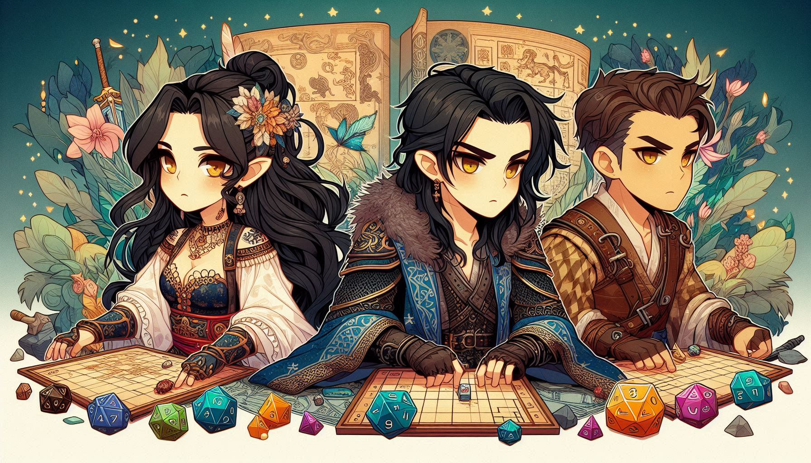

# Once Upon Agentic AI: A Developer's Epic Journey



_"Roll for Initiative... in Python!"_

Welcome, brave adventurer, to the ultimate Strands framework quest! This comprehensive workshop will transform you from a coding apprentice into a master of AI agent orchestration. Through five epic chapters, you'll learn to create, equip, and command digital companions that can think, act, and collaborate like a legendary adventuring party.

## � ️ The Complete Adventure Map

Your journey through the realms of AI agents is carefully structured as a progressive quest. **Each chapter builds upon the previous one** - complete them in order to unlock the full power of Strands!

### 🐉 [Chapter 0: An Unexpected Adventure](0_pre_requisites/)
**Complete the prerequisites before going on an adventure!**

### 🧙‍♂️ [Chapter 1: The Art of Agent Summoning](1_strands_basics/)
**Master the fundamental ritual of agent creation**
- Learn what Strands is and how it works
- Summon your first AI companion
- Configure models and system prompts
- Understand the core concepts of agent development

### ⚔️ [Chapter 2: The Adventurer's Arsenal](2_built_in_tools/)
**Equip your agents with built-in magical tools**
- Discover Strands' powerful built-in tool library
- Learn how agents autonomously choose and use tools
- Master web scraping and information gathering
- Understand tool consent and safety mechanisms

### 🔨 [Chapter 3: The Art of Magical Forging](3_custom_tools/)
**Forge your own custom tools and enchantments**
- Transform Python functions into agent tools
- Create the legendary Dice of Destiny
- Master the `@tool` decorator and documentation
- Build domain-specific capabilities

### 🌐 [Chapter 4: Planar Portals - MCP Integration](4_mcp_integration/)
**Connect to external realms through Model Context Protocol**
- Build and deploy MCP servers
- Create MCP clients for agent integration
- Understand distributed tool architectures
- Master external service connections

### 🏰 [Chapter 5: The Grand Alliance - A2A Mastery](5_a2a_integration/)
**Command multiple agents in perfect harmony**
- Build a complete multi-agent D&D system
- Master Agent-to-Agent (A2A) communication
- Orchestrate specialized agents working together
- Create complex distributed AI applications

## 🎒 Preparing for Your Quest

### Essential Gear (Prerequisites)

Before embarking on this legendary adventure, ensure you have:

- **Python 3.10+** (your trusty spellcasting focus)
- **Basic Python knowledge** (at least Apprentice level)
- **Text editor or IDE** (your magical grimoire)
- **Terminal/Command line** familiarity
- **A sense of adventure** and willingness to experiment! 🎲

### Setting Up Your Sanctum (Installation)

**Step 1: Create Your Magical Environment**
```bash
# Clone the workshop repository
git clone https://github.com/aws-samples/sample-once-upon-agentic-ai.git
cd sample-once-upon-agentic-ai

# Create and activate a virtual environment (highly recommended!)
uv venv

# Activate your environment
# On macOS/Linux:
source .venv/bin/activate
# On Windows:
.venv\Scripts\activate
```

**Step 2: Install the Required Enchantments**
```bash
# Install all workshop dependencies and sync the environment
uv sync
```

**Step 3: Configure Your Model Provider**
The workshop uses configurable AI models. Check the `.env` file and update it with your preferred model:

```bash
# Fast and cost-effective (recommended for workshops)
MODEL_ID=us.anthropic.claude-3-5-haiku-20241022-v1:0

# Or any other provider you prefer
```

Ensure you have proper credentials configured for your chosen provider. Check the [Strands documentation](https://strandsagents.com/latest/documentation/docs/user-guide/concepts/model-providers/amazon-bedrock/) for setup instructions.

## 🎯 How to Embark on Your Quest

### The Sacred Order of Learning

**⚠️ IMPORTANT**: Complete the chapters in order! Each builds upon the previous one's knowledge and skills.

1. **[Start with Chapter 0](0_pre_requisites/)** - Enable the required models to get started
2. **Progress through each chapter** - Don't skip ahead, each chapter introduces essential concepts
3. **Complete all TODOs** - Each chapter has guided exercises to master the concepts
4. **Test your creations** - Run your agents and see them come to life
5. **Experiment and explore** - Try variations and push the boundaries

### Workshop Structure

Each chapter follows the same magical pattern:

- **📜 README Guide**: Complete instructions and background lore
- **🎯 TODO Exercises**: Hands-on coding challenges to complete
- **🧪 Testing Instructions**: How to verify your magical creations work
- **🏆 Solution Reference**: Complete working examples in the `solutions/` folder

### Getting Help

- **📚 Strands Documentation**: [Official Strands Docs](https://strandsagents.com/latest/documentation/docs/)
- **🔍 Solutions Folder**: Reference implementations for each chapter
- **🎲 Experiment Freely**: The best way to learn is by trying things!

## 🧙‍♂️ What is Strands?

Strands is a powerful framework for creating AI agents - think of it as your spellbook for summoning digital companions that can interact with tools and services. Like a well-equipped adventuring party, Strands provides:

- **🎭 Agent Creation**: Easy summoning and configuration of AI companions
- **⚔️ Tool Integration**: Built-in magical implements and custom enchantments
- **🔄 Model Flexibility**: Support for multiple AI providers (different schools of magic)
- **� eExternal Connections**: Integration with services through MCP
- **🏰 Multi-Agent Systems**: Coordinate multiple agents working together

### The Sacred Terminology

- **🤖 Agent**: A digital companion that can reason, decide, and use tools
- **🔧 Tools**: Functions that agents can invoke to perform specific tasks
- **📋 System Prompt**: The character sheet defining your agent's personality and behavior
- **🧠 Model Provider**: The source of intelligence (GPT-4, Claude, etc.)
- **🌐 MCP**: Model Context Protocol for connecting to external services
- **🏰 A2A**: Agent-to-Agent communication for multi-agent systems

## 🎓 Learning Objectives

By completing this workshop, you'll master:

- ✅ **Agent Fundamentals**: Create, configure, and deploy AI agents
- ✅ **Tool Mastery**: Use built-in tools and create custom ones
- ✅ **External Integration**: Connect agents to external services via MCP
- ✅ **Multi-Agent Systems**: Build complex applications with multiple cooperating agents
- ✅ **Real-World Applications**: Create practical, production-ready agent systems

## 🚀 Ready to Begin?

Your adventure awaits! Start with [Chapter 0: An Unexpected Adventure](0_pre_requisites/) and begin your transformation from coding apprentice to Agent Master.

---

## 📚 Additional Resources

### Official Documentation & Tools

- **[Strands Framework Documentation](https://strandsagents.com/latest/documentation/docs/)** - Complete reference and guides
- **[Kiro Agentic IDE](https://kiro.dev/)** - Professional IDE for agent development

### Community & Examples

- **[Strands GitHub Repository](https://github.com/strands-agents/sdk-python)** - Source code and community
- **[Example Projects](https://strandsagents.com/latest/documentation/docs/examples/)** - Real-world implementations

---

## 🎉 Quest Complete: You've Leveled Up!

Congratulations, brave adventurer! By completing this workshop, you've mastered the arcane arts of AI agent development. Your character sheet now includes:

✅ **🧙‍♂️ Agent Summoning** - Create and customize digital companions  
✅ **⚔️ Tool Mastery** - Wield built-in tools and forge custom enchantments  
✅ **🌐 Planar Magic** - Connect to external realms through MCP  
✅ **🏰 Multi-Agent Orchestration** - Command entire fellowships of AI agents  
✅ **🎲 D&D System Mastery** - Build complete game management systems

You've earned the legendary title of **"Agent Artificer"** and are now ready to create your own AI-powered adventures!

### 🚀 Your Next Epic Adventure

The realms of possibility are endless! Consider these legendary quests:

- **🏢 Enterprise Applications**: Build AI assistants for business workflows
- **🎮 Game Development**: Create intelligent NPCs and game masters
- **🔬 Research Tools**: Develop specialized agents for data analysis
- **🤖 Personal Assistants**: Craft AI companions for daily tasks
- **🌐 Distributed Systems**: Architect complex multi-agent networks

### 🎲 The Adventure Never Ends...

Remember, the most epic adventures are the ones you create yourself. Whether you're building the next great AI application or just exploring the boundaries of what's possible, you now have the tools and knowledge to make it happen.

_May your agents be wise, your tools be sharp, and your code compile on the first try!_ 🎲✨

---

**"The best way to predict the future is to build the agents that will create it."** - Modern Developer Wisdom

_Happy coding, Agent Master! 🐉⚔️🧙‍♂️_
